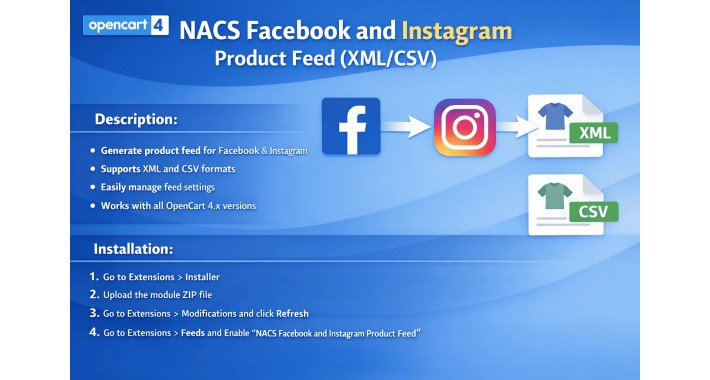

# NACS Facebook and Instagram Product Feed for OpenCart 3 & 4

## Description

Generate a product feed for Facebook Shop and Instagram Shopping
directly from your OpenCart 4 store.

### Features

- Supports XML, CSV, and TSV feed formats\
- Secure feed access with token-based URL\
- Includes filters like:
  - In stock only
  - Minimum quantity
  - Category ID
  - Subcategory option\
- Supports special price and optional tax calculation based on store
  settings\
- Supports additional product images and configurable image size\
- Supports caching mode (live or file) with TTL and optional cron
  refresh URL\
- Supports multi-store, language, and currency parameters in feed URL\
- Designed for OpenCart 4 and works across all OpenCart 4.x versions

---

## Installation

### Step 1

Login to OpenCart Admin.

### Step 2

Go to **Extensions → Installer**.

### Step 3

Upload the file:

    nacs_facebook_feed.ocmod.zip

### Step 4

After upload, click the green **Install** button for this extension in
the Installer list.

### Step 5

Go to **Extensions → Extensions**.

### Step 6

Select the type **Feeds**.

### Step 7

Find **NACS Facebook and Instagram Product Feed XML CSV**.

### Step 8

Click **Install**, then click **Edit**.

### Step 9

Enable the feed and save settings.

### Step 10

Go to **Dashboard → Developer Settings** and refresh cache.

### Step 11

Copy the Feed URL from the settings page and add it in: **Facebook
Commerce Manager → Catalog → Data Sources**.

---

## Usage

- Open the Feed URL in browser to view the generated feed.
- Use the Cron URL if you are using cache mode (file) and want to
  refresh the feed automatically via cron job.

---

## Compatibility

- OpenCart 4.x\
- Extension Type: Feed\
- Package Format: `.ocmod.zip`

---

## Support

If you have any questions, feel free to contact us.
